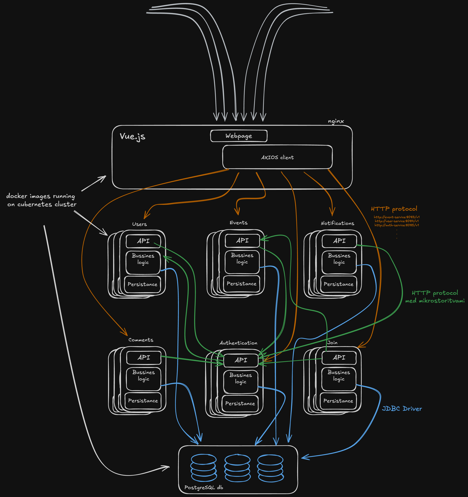

# GreoSpilat App 

*Luka Kalšek, Luka Bele*, Luka^2
*skupina 10*

👦🏼: "A maš še koga za basket?"

👦🏽: "Nimam, lahko pa pogledava na GreoSpilat."

👦🏼: "GreoSpilat?"

GreoSpilat. Aplikacija, ki druženje iz socialnih omrežij vrne pred bloke, na vaška igrišča ali na mestne tekaške steze. Povezuje ljudi, ki jim do svoje športne aktivnosti manjka nekaj igralcev, žoga ali pa motivacija družbe. Namenjena rekreaciji, skupnim treningom ali pa spoznavanju novih ljudi. Preprosto ustvari dogodek, za katerega ti manjka še kakšen igralec, ali pa poglej kaj je na voljo in se pridruži zanimivi aktivnosti. Ko se dogodek zapolni z udeleženci boš o tem obveščen/a in že si lahko na poti na svoj prvi padel! Ne čakaj, GreoSpilat!

## Kazalo

## Uvod

Namen projkta je ustvariti aplikacijo, ki vključuje sodobne tehnologije in prakse v razvoju programske opreme s poudarkom na mikrostoritveni arhitekturi, izpostavljanju RESTful APIjev, pakiranje slik mikrostoritev v vsebnike in stroke, uporabi orodja za orkestracijo in nameščanju le tega v oblak. Cilj je, da se pri razvoju spoznava z novimi tehnologijami in praksami in da končni izdelek (aplikacija) podpira najpogostejše primere uporabe za tip aplikacije, ki jo razvijava. Bodoči uporabnik bo skozi uporabniški vmesnik uporabljal aplikacijo, ki bo z uporabo prej omenjenenih tehnologij in skaliranja zagotavljala prijetno uporabniško izkušnjo. Motivacija za temo je predstavljna na začetku tega dokumenta in je zelo intuitivna, saj sva pri ideji izhajala iz najinih lastnih potreb. Ta aplikacija "rešuje problem", ki je na trenutnem trgu še precej nerešen, oziroma za to ne obstaja zelo očiten ponudnik kot na marsikaterem drugem področju. Primerna je za tako stare in mlade, bolj ali manj aktivne, hkrati pa spodbuja pravo socializacijo in fizkulturo.

## Arhitektura aplikacije

Spodnja slika prikazuje glavne komponente in interakcije med njimi.

- Vue.js komponenta predstavlja uporabniški vmesnik s pogledi kateri je vstopna točka za komunikacijo z zalednim delom.

- Zaledni del predstavljajo mikrostoritve, ki se naprej delijo na API, poslovno logijo, in persistenčno plast za komunikacijo s persistenčnim nivojem.

- Persistenčno plast predstavlja PostgreSQL podatkovna baza z relacijami za vsako od mikrostoritev, ki so med sabo smiselno povezane

- 🟧 Oranžne povezave: Predstavljajo HTTP klice iz uporabniškega vmesnika na REST vire mikrostoritev

- 🟩 Zelene povezave: Predstavljajo HTTP klice iz mikrostoritve na API druge mikrostoritve

- 🟦 Modre povezave: predstavljajo 

### Uporabljene tehnologije

#### Maven

Orodje za avtomatizacijo gradnje javanskih projektov. Skrbi za odvisnosti definirane v parent pom.xml, ki je v glanem direktoriju projekta in jih iz Maven Central repozitorija prenese v naš lokalni repozitorij in jih oporabi pri gradnji projekta. pom.xml datoteko ima tudi vsaka mikrostoritev v svojem direktoriju, prav tako pa vsaka njena komponenta (api, bizLogic, persistance). Maven uporablja enotne sheme projekta, ki da delijo na vire src/ in target/ kej konča zgrajena verzija. Primer strukture za MS user:

    .
    ├── Dockerfile  

    ├── pom.xml   

    ├── users-api  

    │   ├── pom.xml  

    │   ├── src  

    │   │   └── main  

    │   └── target  
    
            └── users-api-1.0.0-SNAPSHOT.jar

    ├── users-bizLogic  

    │   ├── pom.xml  

    │   ├── src  

    │   │   └── main  

    │   └── target  

            └── users-bizLogic-1.0.0-SNAPSHOT.jar

    └── users-persistance 

        ├── pom.xml  
    
        ├── src  
    
        │   └── main  
    
        └── target  
    
            └── users-persistance-1.0.0-SNAPSHOT.jar
    

Maven binary prenesemo iz https://maven.apache.org/download.cgi in sledimo namestitvi. Po spremembah projekt zgradimo z  ``mvn clean install``.

#### KumuluzEE

**Mikrostoritve**
- Uporabniški račun
- Usvarjanje dogodkov / lastnih pobud za športanje
- Zemljevid športnih dogodkov
- Obveščanje o novih dogodkih
- MojProfil
- Nastavitve
- Admin panel

##### Opis mikrostoritev #####
###### Uporabniški račun ######

Glavna opravila te mikrostoritve so kreacija, vračanje, posadabljanje in brisanje uporabniških računov. Prav tako ima storitev svojo podatkovno bazo kjer hrani vse atribute. Preko internega APIja komunicira s drugimi storitvami kot so; zemljevid športnih dogodkov, moj profil, admin panel,...

Mikrostoritev bo preko Kafke ali RabbitMQ omogočala sporočanje drugim mikrostoritvam, ko je uporabnik "online" in pripravljen za športanje. Viden bo tudi na zemljevidu.

###### Usvarjanje dogodkov ######

Mikrostoritev skrbi za uporabniško kreirane dogodke, jih dodaja, spreminja in briše. Sodeluje tesno z mikrostoritvijo za obveščanje o dogodkih in povabilih ter zemljevidom športnih dogodkov. Možna je tudi izvedba ponavljajočih se dogodkov (nedeljska košarka). Storitev ima prav tako svojo podatkovno bazo interni API preko katerega komunicira s drugimi mikrostoritvami. 

###### Zemljevid športnih dogodkov ######

Zemljevid športnih dogodkov je zadolžena za prostorsko in lokacijsko prikazovanje dogodkov. Uporabnikom omogoča da dogodke najdejo in z njimi interaktirajo. Integrirala bo mapping API (GoogleMaps, OpenStreetMaps) in skrbela za querije in filtre iskanja ter vizualizacijo. 

###### Obveščanje o novih dogodkih in povabila ######

Mikrostoritev ki skrbi za obveščanje in povabila bo zadolžena še za odgovore na povabila, reagirala bo na nove evente, updejte ali uporabniške vnose. Push notifikacije v mobilni verziji*.
Omogočala bo tudi časovno razporejanje obvestil in sledenje komu so bila obvestila poslana in njihov odziv na njih. 

###### MojProfil ######

Mikrostoritev mojProfil bo zadolžena ze upravljanje z uporabniškim profilom znotraj sistema. Osredotočala se bo na spreminjanje obstoječega profila, nastavljanje preferenc, radiusa zaznavanja,...
Komunicirala bo z isto bazo kot mikrostoritev za uporabniške račune.

###### Admin panel ######

Admin panel administratorjem omogoča upravljanje in nadzor sistema, moderiranje objav in profilov. Namenjena je dostopu do ostalih mikrostoritev za potrebe moderiranja in spreminjanja. 

###### Nastavitve ######

Kakor admin panel upravlja sistem na ravni administratorja, ga nastavite na ravni uporabnika. Vsak si lahko konfigurira svojo uporabniško izkušnjo s nastavitvami jezika, obvestil, teme, privatnosti,... 

#### Orodja ######
Nekatera so navedena že v shemi
- Meaven
- IntelliJ
- jetty
- JAX-RS
- Kubernetes 
- KumuluzEE
- postgreSQL
- Postman
- Kafke ali RabbitMQ

#### Arhitektura #####

